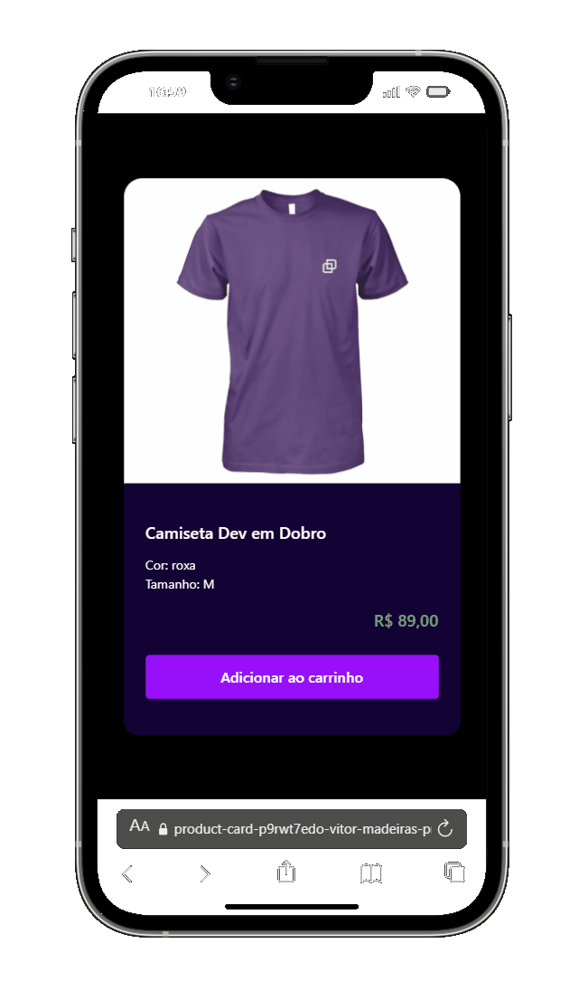

<h1 align="center">
    Product Card
</h1>

Projeto desenvolvido com o objetivo de iniciar os estudos em **React**, aplicando conceitos de componentização, tipagem com TypeScript e estilização com Tailwind CSS.

---

## 📄 Descrição

Este projeto consiste em um **card de produto**, criado para praticar os fundamentos do React no ecossistema moderno, utilizando **Vite** como ferramenta de build, **TypeScript** para tipagem estática e **Tailwind CSS** para estilização.

O foco principal foi entender a estrutura de componentes, organização do projeto e boas práticas no desenvolvimento front-end.

---

## 🔗 Preview

<div align="center">

  ### Mobile 📱  
  

  <br>
  
  ### Desktop 💻
  
</div>

<br>


🚀 Deploy do projeto:  
https://product-card-two-zeta.vercel.app/

---

## 🚀 Tecnologias Utilizadas

- React
- TypeScript
- Tailwind CSS
- Vite

---

## ⚙️ Funcionalidades

- Exibição de card de produto
- Componentização com React
- Tipagem de props com TypeScript
- Estilização moderna e responsiva com Tailwind CSS

---

## ▶️ Como rodar o projeto localmente

Siga os passos abaixo para rodar o projeto em sua máquina:

```bash
# Clone o repositório
git clone https://github.com/MadeiraVitor/product-card.git

# Acesse a pasta do projeto
cd product-card

# Instale as dependências
npm install

# Inicie o servidor de desenvolvimento
npm run dev
```
O projeto estará disponível em:
http://localhost:5173

## 📚 Aprendizados
- Estruturação de componentes no React
- Tipagem com TypeScript
- Estilização com Tailwind CSS
- Uso do Vite para ambiente de desenvolvimento

## 👤 Autor
Desenvolvido por **Vitor Madeira**  
<a href="https://www.linkedin.com/in/vitor-madeira/" target="_blank"></a>

